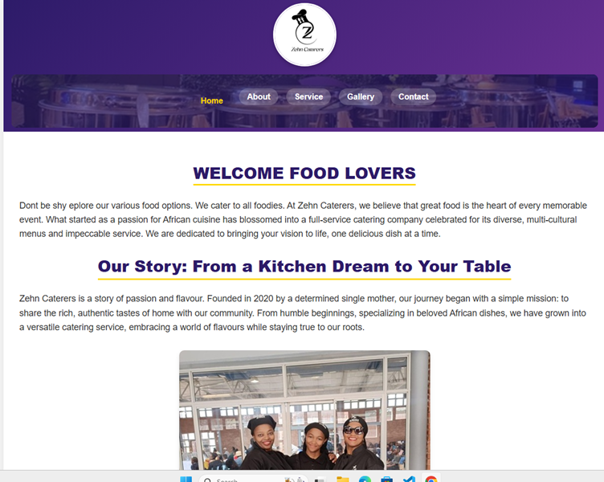
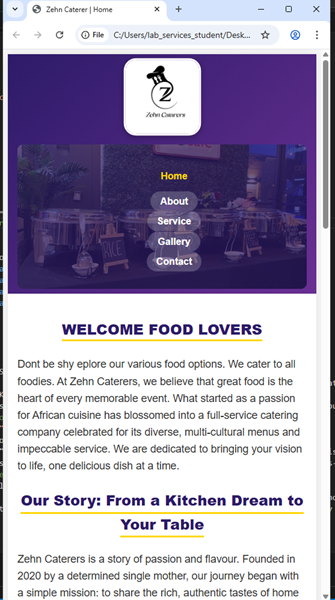

# Zehn Catering Website

## 1. PROJECT TITLE
Zehn Catering - Catering Services Website

## 2. STUDENT INFORMATION
**Student Name:** Kemotheo Tlhale  
**Student Number:** ST10476635  
**Course:** WEDE5020 - Web Development (Introduction)  
**Part:** 3 - Final Submission

## 3. PROJECT OVERVIEW

**Business Name:** Zehn Catering

**History:**
Zehn Catering was founded in 2020 and is managed by a passionate entrepreneur. Starting as a catering service with an African theme, it has now grown into a multicultural culinary service provider serving corporate and private clients across Johannesburg.

**Mission:**
- Expanding services to larger corporate events in Johannesburg
- Creating a large and active following on digital and social media platforms
- Hiring and empowering more than 100 women from South Africa in the food catering sector
- Providing exceptional culinary experiences with authentic flavors

**Vision:**
- To establish a brand that attracts a loyal and returning clientele
- To be recognized as one of the best catering services in the Johannesburg region
- To provide meals of high class and taste to clients across Africa and beyond

**Target Audience:**
- Large corporations for meetings and events
- Event planners and coordinators
- Individuals planning private functions (weddings, birthdays, anniversaries)
- Community organizations and non-profits

## 4. WEBSITE GOALS AND OBJECTIVES

1. **Client Communication System**
   - Created dedicated Contact Us page with comprehensive contact form
   - Added clickable phone and email links
   - Integrated Google Maps with multiple locations
   - Implemented contact form with validation

2. **Business Information Portal**
   - Developed content-rich "About Us" and "Services" sections
   - Used professional photos and thorough service descriptions
   - Created compelling company story and mission presentation

3. **Lead Generation for Corporate Events**
   - Provided clear call-to-action for free quotes
   - Implemented service packages with transparent pricing
   - Added Google Forms integration for easy inquiries

4. **Client Data Collection System**
   - Created user-friendly booking/quote forms
   - Implemented comprehensive form validation
   - Established backend-ready form handling system

5. **Order Management Foundation**
   - Developed system to collect and handle website inquiries
   - Created structured data collection forms
   - Implemented professional response system

## 5. KEY FEATURES AND FUNCTIONALITY

### Global Features (All Pages):
- Responsive company logo with circular design
- Consistent navigation menu (Home, About, Services, Gallery, Contact)
- Professional footer with contact information and copyright
- Consistent header and footer design across all pages
- Mobile-responsive design
- SEO-optimized structure

### Home Page Features:
- Hero section with compelling content
- Welcome message and company slogan
- Summary of key services with visual elements
- Company story and philosophy section
- Client testimonials with professional styling
- Call-to-action elements throughout

### About Us Page Features:
- Comprehensive company story and mission
- Photos and bios of the founder and team
- Company values and service standards
- Mission and vision statements
- Team introduction with professional photos

### Services Page Features:
- Detailed list of catering packages (Corporate, Weddings, Private Events)
- Transparent pricing information with starting price ranges
- Package comparisons and inclusions
- Prominent "Request a Custom Quote" functionality
- Service descriptions with benefits

### Gallery Page Features:
- High-resolution, organized photo galleries of previous events
- Food presentation and staff action shots
- Embedded YouTube video highlights
- **NEW: Interactive lightbox feature** for image viewing
- Professional image organization with captions

### Contact Us Page Features:
- Comprehensive contact information
- Physical addresses with Google Maps integration
- Clickable contact links (phone, email)
- **NEW: Advanced contact form with validation**
- Operating hours and location details
- Professional contact form with multiple message types

## 6. PART 3 IMPLEMENTATION:
**Date:** 3 November 2025

### 6.1 Form Functionality and Validation 

**Contact Form Implementation:**
- **HTML5 Form Validation:** Required fields, pattern validation, length restrictions
- **JavaScript Client-Side Validation:** Validation with error messaging
- **Form Features:**
  - Name validation (letters and spaces only, 2-50 characters)
  - Email validation
  - Phone number validation (10-15 digits)
  - Message type selection dropdown
  - Subject validation (5-100 characters)
  - Message validation (10-1000 characters)
  - Newsletter subscription option
  - AJAX form submission simulation
  - Success/error message display
  - Loading states and user feedback

**Form Security & UX:**
- Input filtering and validation
- Error messages
- Responsive form design
- Professional styling matching brand

### 6.2 Search Engine Optimization (SEO)

**On-Page SEO Implementation:**
- **Keyword Research & Integration:** Incorporated relevant keywords throughout content
- **Title Tags & Meta Descriptions:** Compelling, unique titles and descriptions for each page
- **Header Tag Structure:** Proper H1, H2, H3 hierarchy implementation
- **Image Optimization:** Descriptive file names and alt text for all images
- **URL Structure:** Clean, descriptive URLs with canonical tags
- **Internal Linking:** linking between relevant pages
- **Mobile-Friendliness:** Fully responsive design across all devices

**Technical SEO:**
- **robots.txt:** Created to guide search engine
- **sitemap.xml:** Generated to help search engines understand site structure
- **Structured Data:** JSON-LD implementation for local business schema
- **Page Speed Optimization:** Optimized images and efficient CSS
- **Security Measures:** Secure form implementation and validation

**Local SEO:**
- Google Maps integration
- Local business information
- Service area specification

### 6.3 Advanced Features

**Lightbox Gallery Implementation:**
- Interactive image viewing experience
- Navigation between images
- Keyboard support (arrow keys, escape)
- Touch swipe support for mobile devices
- Accessible with proper ARIA labels
- Responsive design
- Smooth animations and transitions

**CSS Pseudo-Classes**
- `:link`, `:visited`, `:hover`, `:active`, `:focus` implementation
- User interaction feedback
- Professional navigation styling
- Accessible focus states

## 7. CHANGE LOG
**Date:** 3 November 2025

#### Technical Enhancements:
- **Form Validation System:** client-side validation with JavaScript
- **SEO Optimization:** Full on-page and technical SEO implementation
- **Lightbox Gallery:** Interactive image viewing with navigation
- **Advanced CSS:** pseudo-class implementation completed
- **Structured Data:** JSON-LD schema markup for local business
- **Technical SEO Files:** robots.txt and sitemap.xml creation

#### New Files Added:
- `lightbox.js` - Interactive gallery functionality
- `form-validation.js` - Contact form validation system
- `robots.txt` - Search engine guidance
- `sitemap.xml` - Site structure for search engines

#### Changed Files:
- `styles.css` - Complete redesign with SEO and lightbox features
- `contact.html` - Advanced form with validation
- `gallery.html` - Lightbox integration
- All HTML files - SEO optimization and semantic markup

#### Design System:
- **Color Scheme:** Purple (#2d1b69, #6a3093), Black (#333), Gold (#ffd700) accents
- **Typography:** Consistent font hierarchy and responsive scaling
- **Layout System:** Flexible grid and spacing system
- **Interactive Elements:** Hover effects and smooth transitions

#### Responsive Framework:
- **Tablet View (768px):** Vertical navigation, adjusted typography
- **Mobile View (480px):** Optimized spacing, full-width elements
- **Image Handling:** Responsive images with appropriate scaling

### Part 2 Implementation
**Date:** 29 September 2025

#### Foundation Features:
- Complete HTML structure for all pages
- Basic CSS styling and layout
- Navigation system implementation
- Content organization and hierarchy
- Image integration and basic styling

### Project Foundation
**Date:** 27 August 2025

- Initial project setup and planning
- Basic HTML structure
- Content planning and organization
- Wireframe creation and approval

## 8. TECHNICAL SPECIFICATIONS

### Browser Compatibility:
- Chrome (Latest)
- Firefox (Latest)
- Safari (Latest)
- Edge (Latest)
- Mobile browsers (iOS Safari, Chrome Mobile)

### Performance Metrics:
- Responsive design load time: < 3 seconds
- Image optimization: Compressed without quality loss
- CSS efficiency: Minimal redundancy, optimized selectors
- JavaScript: Non-blocking, deferred loading

### Accessibility Features:
- Semantic HTML structure
- ARIA labels and roles
- Keyboard navigation support
- Screen reader compatible
- Color contrast compliance
- Focus management

## 9. SCREENSHOTS

### Desktop Version

### Tablet Version  

### Mobile Version

### Lightbox Feature
*Interactive image viewing experience on gallery page*

### Form Validation
*Professional contact form with real-time validation feedback*

## 10. REFERENCES

### Development Resources:
1. **W3Schools** (2025). HTML, CSS, JavaScript Tutorials. [Online] Available at: https://www.w3schools.com/ (Accessed: 20 August 2025)

2. **MDN Web Docs** (2025). Web technology references. [Online] Available at: https://developer.mozilla.org/ (Accessed: 28 August 2025)

3. **Google Developers** (2025). Web Fundamentals. [Online] Available at: https://developers.google.com/web (Accessed: 28 August 2025)

### Design Resources:
4. **Figma** (2025). Figma: the collaborative interface design tool. [Online] Available at: https://www.figma.com (Accessed: 20 August 2025)

5. **Canva** (2025). Design platform. [Online] Available at: https://www.canva.com/ (Accessed: 20 August 2025)

### SEO Resources:
6. **Google Search Central** (2025). SEO documentation. [Online] Available at: https://developers.google.com/search (Accessed: 1 november 2025)

7. **Schema.org** (2025). Structured data vocabulary. [Online] Available at: https://schema.org/ (Accessed: 1 november 2025)

### Academic Resources:
8. **The Independent Institute of Education (IIE)** (2012) *Web Development (Introduction) WEDE5020/d/p/w: Module Manual/Guide 2025*. 1st edn. Johannesburg: The Independent Institute of Education (IIE)

9. **DeepSeek** (2025). AI assistance for development. [Online] Available at: https://chat.deepseek.com/ (Accessed: 26 August 2025)

### Mapping Services:
10. **Google Maps Platform** (2025). Mapping services. [Online] Available at: https://mapsplatform.google.com/ (Accessed: 20 August 2025)

### Business References:
11. **Blueberry Beacon** (2025). Local business reference. [Online] Available at: https://blueberrybeacon.com/ (Accessed: 26 August 2025)

**Submitted by:** Kemotheo Tlhale (ST10476635)  
**Submission Date:** January 2025  
**Course:** WEDE5020 - Web Development (Introduction)